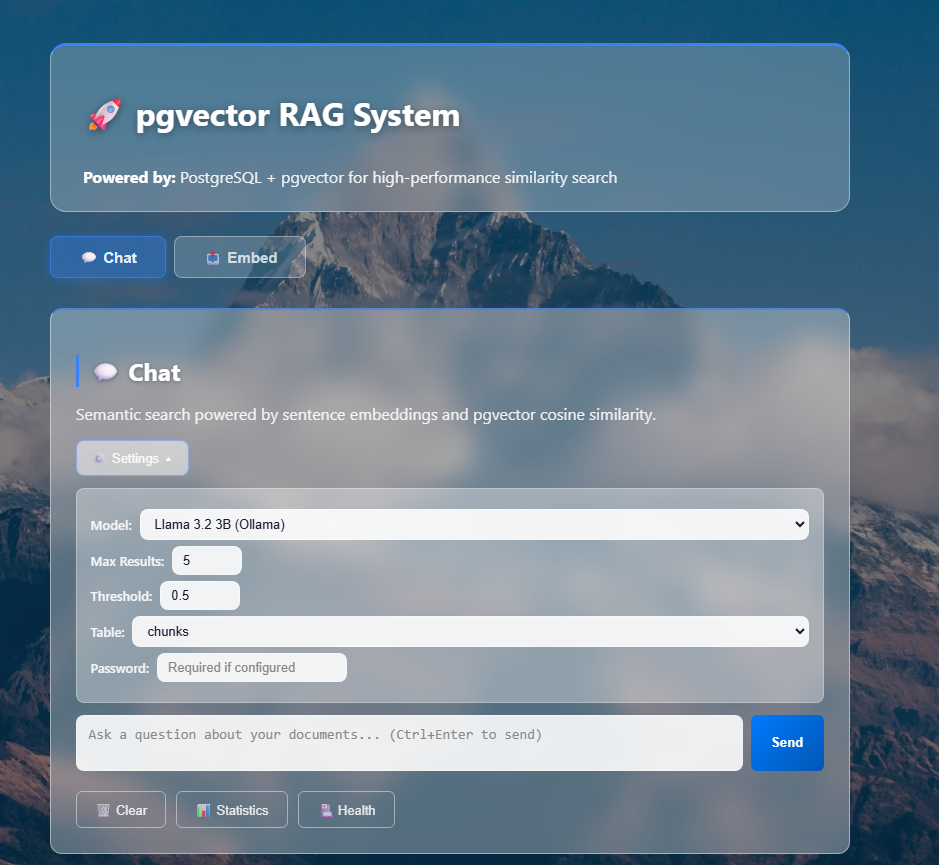
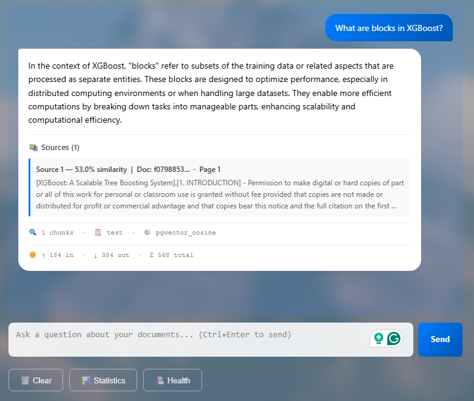
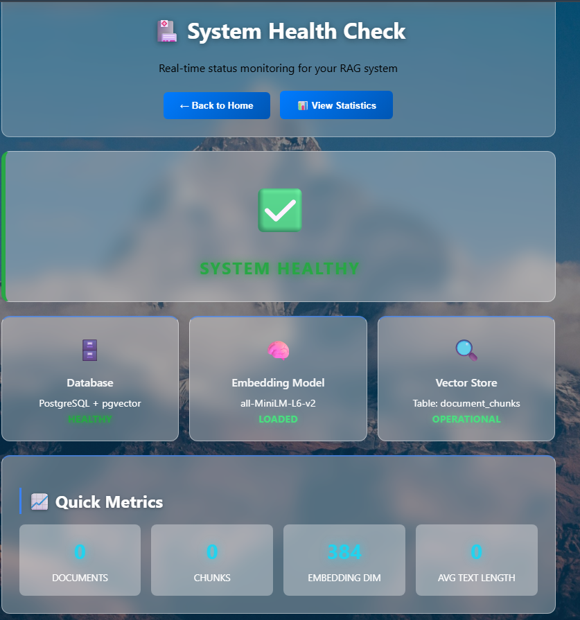
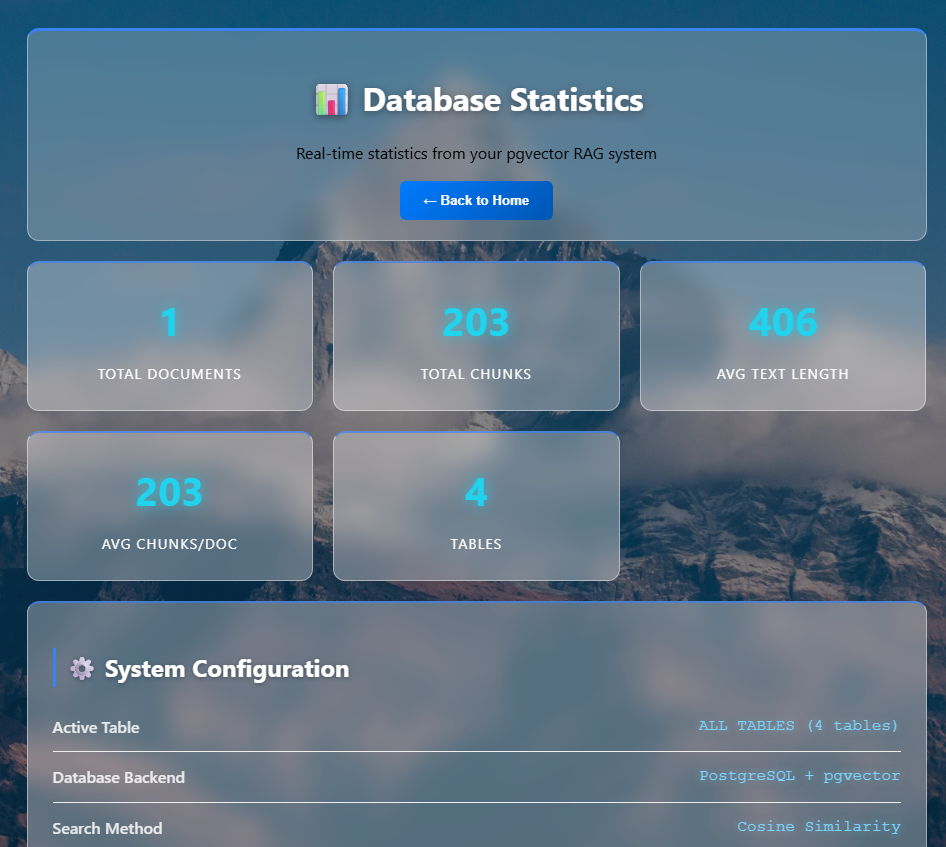
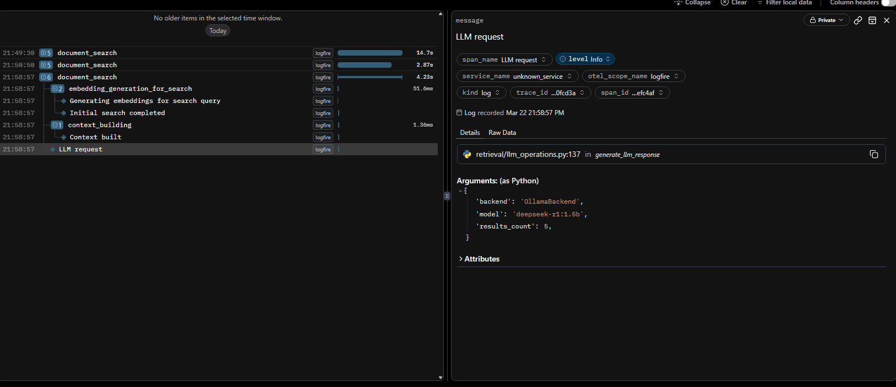

# RAG with pgvector

A Retrieval-Augmented Generation (RAG) system built with FastAPI, PostgreSQL + pgvector, and Chonkie for markdown-aware chunking.

## How It Works

```
PDF file  →  Parser (choose one)       →  MarkdownChunker  →  pgvector  →  Query + Rerank  →  LLM Answer (choose one)
input/pdf/   • PyMuPDF (default)          (chonkie)           (PostgreSQL)   (BM25)            • Gemini 2.5 Flash  (google-generativeai SDK)
             • Docling + Ollama VLM                                                             • DeepSeek-R1 8B    (Ollama /api/generate)
             • Docling + Gemini Vision                                                          • DeepSeek-R1 1.5B  (Ollama)
                                                                                                • Llama 3.2 3B      (Ollama)
```

1. **Upload a PDF** - choose a parsing backend: fast PyMuPDF (default), Docling + local Ollama VLM (`qwen2.5vl:7b`), or Docling + Gemini Vision. The result is stored as Markdown in `input/markdown/`
2. **Chunk** - the Markdown is split into chunks using a structure-aware MarkdownChunker
3. **Embed** - each chunk is embedded with `all-MiniLM-L6-v2` and stored in pgvector
4. **Query** - a question triggers vector similarity search + BM25 reranking
5. **Answer** - top chunks are passed to your chosen LLM: **Gemini 2.5 Flash** (cloud) or **DeepSeek-R1 8B** running locally via Ollama

---

## Quick Start

### 1. Prerequisites

- [Docker Desktop](https://www.docker.com/products/docker-desktop) (8 GB+ RAM allocated)
- A [Google Gemini API key](https://makersuite.google.com/app/apikey) *(optional - only required for Gemini parsing or Gemini Q&A)*
- [Ollama](https://ollama.com) running locally *(optional - required for local LLM parsing and Q&A)*

### 2. Configure environment

```bash
cp .env.example .env
# Edit .env - minimum required:
#   GOOGLE_API_KEY=your-key-here
#   POSTGRES_PASSWORD=a-secure-password
```

### 3. Build and run

The Dockerfile uses a two-stage build. The first stage (`Dockerfile.base`) installs heavy ML
dependencies and only needs to run once. Subsequent builds are fast.

```bash
# Step 1 - build the base image (first time only, ~8–10 min)
docker build -f deployment/Dockerfile.base -t rag-base:latest .

# Step 2 - build and start all services (~1–2 min)
docker compose up --build
```

The app is ready when you see:
```
rag_app  | INFO:     Application startup complete.
```

Open **http://127.0.0.1:8000**

> **Windows users:** use `http://127.0.0.1:8000` (not `localhost`). Windows 11 resolves `localhost` to IPv6 (`::1`) but Docker only binds to IPv4, causing the browser to hang silently.

| URL | Description |
|-----|-------------|
| http://127.0.0.1:8000 | Web UI - Chat and Embed tabs |
| http://127.0.0.1:8000/stats | Database statistics |
| http://127.0.0.1:8000/health | System health check |
| http://127.0.0.1:8000/docs | **Swagger UI - interactive API docs** |
| http://127.0.0.1:8000/redoc | ReDoc - readable API reference |

> **Swagger UI** (`/docs`) lets you call every endpoint directly from the browser - no curl or Postman needed. Click an endpoint → **Try it out** → fill in params → **Execute**.

---

## Local Development

For running notebooks and scripts outside Docker, use **uv** (fast Python package manager).

```bash
# Install uv (once)
pip install uv

# Create a venv and install dependencies from deployment/requirements.txt
uv venv
uv pip install -r deployment/requirements.txt

# Run a script with the project venv
uv run python scripts/process_pdf.py

# Or activate the venv manually
source .venv/bin/activate
```

Dependencies are defined in `deployment/requirements.txt`. For testing, also install pytest:

```bash
uv pip install pytest pytest-asyncio httpx
PYTHONPATH=. pytest tests/unit -v
```

> **GPU note:** If you need CUDA, install PyTorch with the CUDA wheels instead of CPU-only.

---

## Testing

Tests are designed to run inside Docker so dependencies and the PostgreSQL + pgvector extension are available.

### Run all tests

```bash
docker compose --profile test run --rm test
```

### Run only unit tests (no database required)

```bash
docker compose --profile test run --rm test pytest tests/unit -v
```

### Run only integration tests (requires PostgreSQL)

```bash
docker compose --profile test run --rm test pytest tests/integration -v
```

### Run a specific test file

```bash
docker compose --profile test run --rm test pytest tests/unit/test_llm_provider.py -v
```

### Run with coverage

```bash
docker compose --profile test run --rm test pytest --cov=. --cov-report=html --cov-report=term
```

### Test markers

- `unit` — no external services (mocked LLM, DB, embedding model)
- `integration` — requires PostgreSQL running
- `slow` — intentionally skipped with `pytest -m "not slow"`

The `tests/` directory is mounted as a volume in the test container, so you can edit tests locally and re-run without rebuilding the image.

---

## Web UI

Open **http://127.0.0.1:8000**. The main page has two tabs: **Chat** and **Embed**.

### Chat tab

Ask questions against documents already stored in the database.

1. Click **💬 Chat** (active by default).
2. *(Optional)* Click **⚙️ Settings** to change:
   - **Model** - Gemini 2.5 Flash (cloud) or a local Ollama model
   - **Max Results** - number of chunks retrieved (default: 5)
   - **Threshold** - minimum similarity score to include a chunk (default: 0.5)
   - **Table** - which document table to search
   - **Password** - required only if `APP_ACCESS_PASSWORD` is set
3. Type your question in the input box and press **Send** or `Ctrl+Enter`.
4. The response appears with:
   - The LLM-generated answer
   - Source chunks used (document ID, similarity %, page number)
   - A stats line: chunks found · table · search method
   - Token usage (input / output / total)
5. To start a new session, click **🗑️ Clear** - this removes all messages from the view.

> The chat area is hidden until you send the first message.

### Embed tab

Upload and process a new document into the database.

1. Click **📤 Embed**.
2. Fill in the form:
   - **Document File** - select a PDF, DOCX, or TXT file
   - **PDF Parsing Backend** - `Default (PyMuPDF only)` for speed; `Gemini Vision (docling)` or `Ollama VLM (docling)` for richer extraction of images and complex tables
   - **Access Password** - required only if `APP_ACCESS_PASSWORD` is set
   - **Table Name** - target table in the database (default: `document_chunks`)
   - **Chunk Size** - token size per chunk (default: 512)
3. Click **📤 Upload & Process**. Processing runs as a background task via Celery.

### Navigation

From the main page, use the bottom buttons to jump to:
- **📊 Statistics** - document and chunk counts, system configuration, timeline
- **🏥 Health** - live status of the database, embedding model, and vector store

### 4. Stop services

```bash
docker compose down
```

---

## Services

| Service | Port | Description |
|---------|------|-------------|
| `app` | 8000 | FastAPI application |
| `postgres` | 5432 | PostgreSQL + pgvector |
| `redis` | 6379 | Celery broker |
| `celery_worker` | - | Background task worker |
| `langfuse` | 3000 | LLM observability UI *(observability profile only)* |
| `pgadmin` | 5050 | DB admin UI *(dev profile only)* |

```bash
# Start pgAdmin (optional database UI)
docker compose --profile dev up -d pgadmin
# Then open http://127.0.0.1:5050

# Start Langfuse (optional LLM observability UI)
docker compose --profile observability up -d langfuse
# Then open http://127.0.0.1:3000
```

---

## API Endpoints

| Method | Path | Description |
|--------|------|-------------|
| `GET` | `/` | Web UI |
| `POST` | `/upload` | Upload and process a document |
| `POST` | `/query` | Ask a question, get a RAG answer |
| `GET` | `/tables` | List all chunk tables |
| `GET` | `/tables/count` | Count chunk tables in the database |
| `GET` | `/stats` | Database statistics |
| `GET` | `/health` | Health check |
| `GET` | `/supported-types` | Accepted file formats |
| `DELETE` | `/table/{name}` | Delete a document table |
| `GET` | `/docs` | FastAPI Swagger UI |

### Examples

**Upload a PDF:**
```bash
curl -X POST "http://127.0.0.1:8000/upload" \
  -F "file=@input/pdf/llama2.pdf" \
  -F "chunk_size=512" \
  -F "table_name=documents"
```

**Ask a question:**
```bash
curl -X POST "http://127.0.0.1:8000/query" \
  -H "Content-Type: application/json" \
  -d '{"query": "What safety measures does Llama 2 have?", "limit": 5}'
```

---

## Project Structure

```
rag_with_llama/
│
├── input/                        # Runtime I/O
│   ├── pdf/                      # Drop PDFs here (e.g. llama2.pdf)
│   └── markdown/                 # Auto-generated Markdown output
│
├── ingestion/                    # Document ingestion pipeline
│   ├── processors/
│   │   ├── pdf_to_markdown.py    # PDFToMarkdownConverter (PDF → Markdown)
│   │   ├── pdf_processor.py      # Raw text extraction fallback
│   │   ├── docx_processor.py
│   │   ├── txt_processor.py
│   │   └── processor_factory.py  # Picks processor by file type
│   ├── chunking/
│   │   └── chunker_factory.py    # token / recursive / markdown / semantic
│   ├── embedding/
│   │   └── vector_store.py       # ChunkEmbeddingPipeline + pgvector
│   ├── text_cleaning/
│   │   └── cleaners.py
│   └── validation/
│       └── file_validator.py
│
├── retrieval/
│   ├── search.py                 # Vector search → BM25 rerank → LLM
│   ├── llm_operations.py         # LLM answer generation (Gemini or Ollama)
│   └── utils.py                  # BM25 scorer
│
├── api/
│   ├── app.py                    # FastAPI app, route registration
│   ├── config.py                 # Re-export shim (config lives in config/)
│   ├── validators.py
│   ├── templates.py              # Inline HTML templates
│   └── routes/
│       └── document_routes.py    # All active endpoints
│
├── config/
│   └── app_config.py             # AppConfig, AppSettings, DatabaseConfig
│
├── models/
│   └── models.py                 # Pydantic request/response models
│
├── worker/
│   ├── celery_app.py
│   └── tasks.py                  # Async upload task
│
├── graph_processing/             # Knowledge graph - DISABLED (code preserved)
│
├── tests/
│   ├── unit/                     # No DB required
│   └── integration/              # Requires running postgres
│
├── docs/                         # Developer documentation
│   ├── 20260619_chunking-strategies.md
│   ├── 20260619_docker-setup.md
│   ├── 20260619_project-architecture-summary.md
│   └── 20260619_testing.md
│
├── deployment/
│   ├── Dockerfile                # App image (uses Dockerfile.base)
│   ├── Dockerfile.base           # Heavy ML deps (build once)
│   ├── Dockerfile.postgres       # Postgres + pgvector
│   ├── Dockerfile.test           # Test runner
│   ├── requirements.txt
│   └── Makefile                  # Test + dev shortcuts
│
├── docker-compose.yml
└── .env.example
```

---

## Configuration

Copy `.env.example` to `.env` and set these values:

| Variable | Required | Default | Description |
|----------|----------|---------|-------------|
| `GOOGLE_API_KEY` | No* | - | Gemini API key *(required only for Gemini parsing or Gemini Q&A)* |
| `POSTGRES_PASSWORD` | Yes | `admin` | Change in production |
| `POSTGRES_DB` | No | `rag_db` | Database name |
| `GEMINI_MODEL` | No | `gemini-2.5-flash` | Gemini model for Q&A |
| `OLLAMA_BASE_URL` | No | `http://host.docker.internal:11434` | Ollama endpoint (Docker uses host network) |
| `OLLAMA_MODEL` | No | `deepseek-r1:8b` | Text model for RAG Q&A (runs locally via Ollama) |
| `OLLAMA_VLM_MODEL` | No | `qwen3.5:9b` | VLM model for PDF image/table extraction (multimodal) |
| `CHUNKER_TYPE` | No | `markdown` | `markdown` / `recursive` / `token` / `semantic` |
| `APP_ACCESS_PASSWORD` | No | *(disabled)* | Password-protect the web UI |
| `LOGFIRE_WRITE_TOKEN` | No | - | [Logfire](https://logfire.pydantic.dev/) monitoring |

### How LLM backends work

Each model type uses a dedicated backend in `retrieval/llm_operations.py`:

**Gemini** - calls `google-generativeai` SDK directly:
```
GeminiBackend  →  genai.GenerativeModel(model).generate_content(prompt)  →  Gemini API
```

**Ollama** - calls the Ollama REST API directly over HTTP:
```
OllamaBackend  →  POST OLLAMA_BASE_URL/api/generate  →  Ollama (runs on Windows host)
```

- `OLLAMA_MODEL` - the text model used to answer RAG questions (e.g. `deepseek-r1:8b`)
- `OLLAMA_VLM_MODEL` - the vision model used to describe images and complex tables during PDF parsing (Docling + Ollama backend only)

No API key or internet connection is required for Ollama models. `GOOGLE_API_KEY` is only needed when using a Gemini model.

---

## Running Tests

The Makefile is in `deployment/`. Use it with:

```bash
make -f deployment/Makefile <target>
```

| Command | Description |
|---------|-------------|
| `make -f deployment/Makefile test-unit` | Unit tests locally (no DB) |
| `make -f deployment/Makefile test-integration` | Integration tests locally |
| `make -f deployment/Makefile test-docker-unit` | Unit tests in Docker |
| `make -f deployment/Makefile test-docker` | All tests in Docker |
| `make -f deployment/Makefile coverage` | HTML coverage report |

Or run pytest directly:
```bash
pytest tests/unit -v           # fast, no database needed
pytest tests/integration -v    # requires running postgres
```

---

## Screenshots

**Home screen (idle - no chat session yet):**




**Chat session - query + results:**



**Swagger UI (interactive API docs):**


**Health check:**



**Database statistics:**



**Logfire monitoring:**




---

## Rebuilding After Changes

```bash
# Code changes only (fast, ~30 seconds)
docker compose restart app celery_worker

# Dependency changes (slower, ~1–2 min)
docker compose up --build
```

---

## Troubleshooting

**Services not starting:**
```bash
docker compose ps
docker compose logs app
docker compose logs postgres
```

**Port 8000 already in use:**
```bash
# Change in docker-compose.yml: "8001:8000"
```

**Reset the database (deletes all data):**
```bash
docker compose down -v
docker compose up --build
```

**Full clean rebuild:**
```bash
docker compose down -v
docker system prune -a
docker build -f deployment/Dockerfile.base -t rag-base:latest .
docker compose up --build
```

**Chunk insertion fails with `asyncpg DataError: expected str, got dict` or `expected str, got list`:**

asyncpg requires explicit types when inserting into `vector` and `jsonb` columns. The SQL must use explicit casts and the Python values must match what the cast expects:

```sql
-- SQL (in vector_store.py)
INSERT INTO {table} (id, document_id, text, embedding, metadata)
VALUES ($1, $2, $3, $4::vector, $5::jsonb)
```

```python
# Python - $4::vector expects a string like "[0.1, 0.2, ...]"
embedding_str = "[" + ",".join(map(str, embedding)) + "]"

# Python - $5::jsonb expects a JSON string, not a dict
json.dumps(chunk.metadata if chunk.metadata else {})
```

Passing a raw `list` for `$4` or a raw `dict` for `$5` causes asyncpg to raise a `DataError`. The metadata field stores the full page content alongside chunk-level fields - no truncation is applied.

**Commands:**
```bash
docker exec rag_postgres psql -U admin -d rag_db -c "\dt"
docker exec -it rag_redis redis-cli
```

## Known Limitations

**Retrieval**
- Structural queries fail - questions like "how many points are in this section?" require the model to count items within a document section, but the chunker splits content across chunk boundaries. The relevant items may span multiple chunks or the section header may land in a different chunk than its body, so the LLM sees incomplete context and cannot answer correctly.
- Document-level headers are not reliably retrieved - top-level headings (chapter titles, section names) are sometimes separated from their content during chunking. Asking "what does section X cover?" may return no useful chunks if the header chunk scores below the similarity threshold.

**Parsing**
- Docling + Ollama/Gemini section detection needs improvement - the VLM-assisted parser does not always correctly identify section boundaries in complex PDFs (e.g., multi-column layouts, tables that span sections). This can cause section headings to merge with unrelated content or be dropped entirely.

---

## Further Reading

- [Chunking Strategies](docs/20260619_chunking-strategies.md)
- [Project Architecture](docs/20260619_project-architecture-summary.md)
- [Testing Guide](docs/20260619_testing.md)
